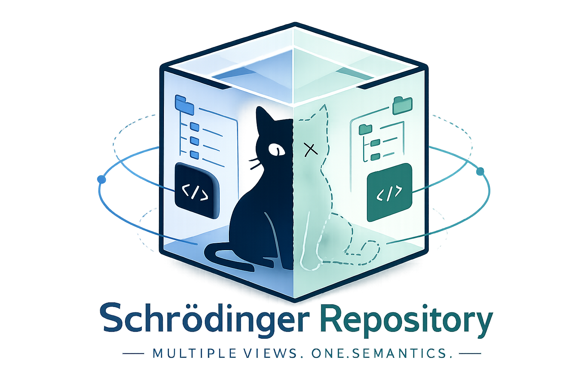

  

# 🧪📦 Schrödinger-Repo

This repository is a clean release of **Schrödinger-Repo**, a framework for **SWE-bench code-agent leakage analysis**.

In SWE-bench-style evaluation, no matter how much information may leak through benchmark metadata, the agent still only gets to see the actual repository contents **after entering the Docker environment**. Schrödinger-Repo is built around that boundary: it perturbs what the agent observes when interacting with the repository inside the container, while keeping semantics and functionality as equivalent as possible.

The goal is to separate:

- genuine reasoning ability
- reliance on leaked priors from training data or benchmark surface cues

Such priors include:

- repo identity
- namespace and symbol conventions
- layout and organization regularities
- implementation-form memorization

## ✨ Included Levels

- **Level 1 + Level 2**
  - `bash run_level1_level2.sh`
- **Level 3**
  - `bash run_level3.sh`
- **Level 1 + Level 2 + Level 3**
  - `bash run_level1_level2_level3.sh`
- **Level 4**
  - `bash run_level4.sh`

In this clean release, **Level 4 means the former Level 4B**.

- ✅ kept: `llm_function_body_rewrite` / `agentic_function_body_rewrite`

## 🪜 Level Definitions

- **Level 1**: issue / repo identity perturbation
- **Level 2**: namespace / symbol / path perturbation
- **Level 3**: layout / intra-file reordering perturbation
- **Level 4**: semantic-preserving function-body rewrite

## 🏗️ Build Entry Points

- `bash build_level1.sh`
- `bash build_level2.sh`
- `bash build_level3.sh`
- `bash build_level4.sh`

## ▶️ Run Entry Points

- `bash run_level1_level2.sh`
- `bash run_level3.sh`
- `bash run_level1_level2_level3.sh`
- `bash run_level4.sh`

## 💡 Full vs Lite

By design, **Level 3 and Level 4 should ideally perturb the full code repository**.

That is the full version of the method:

- Level 3: repository-scale layout perturbation
- Level 4: repository-scale implementation-form rewriting

In practice, there is also a **lite path** used to reduce construction cost and improve verification success:

- perturb only the code regions actually touched by baseline trajectories
- apply local but verifiable transformations around baseline-touched code

So this repository preserves both:

- the core logic for full-repository perturbation
- the lighter baseline-touched-code workflow used in practice
